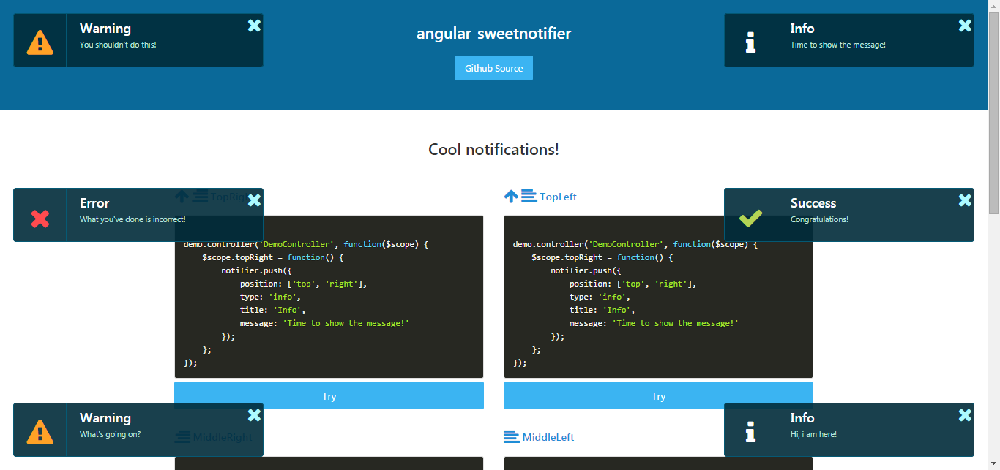

# angular-sweetnotifier  #
=====================

A simple angular notifier




Full featured demo: [DEMO](http://leftstick.github.io/angular-sweetnotifier/)

## Requirements ##

- [angular][angular-url]
- [FontAwesome][fontawesome-url]


## Install ##

```powershell
bower install font-awesome --save
bower install angular-sweetnotifier --save
```

## Import ##

```html
<!DOCTYPE html>
<html>
<head>
    <meta charset="UTF-8">
    <title>DEMO</title>
    <link rel="stylesheet" type="text/css" href="path/font-awesome/css/font-awesome.min.css">
    <link rel="stylesheet" type="text/css" href="path/angular-sweetnotifier/dist/angular-sweetnotifier.min.css">
</head>
<body>
    <script type="text/javascript" src="path/angular/angular.min.js"></script>
    <script type="text/javascript" src="path/angular-animate/angular-animate.min.js"></script>
    <script type="text/javascript" src="path/angular-sweetnotifier/dist/angular-sweetnotifier.min.js"></script>
</body>
</html>
```

## Usage ##

```html
<chartist tooltip="lineTooltip" class="ct-chart ct-minor-seventh" type="Bar" data="barData" options="barOpts"></chartist>
```

```javascript

var demo = angular.module('demo', ['angular-sweetnotifier']);

demo.controller('DemoController', function($scope, notifier) {

    $scope.topRight = function() {
        notifier.push({
            position: ['top', 'right'],
            type: 'info',
            title: 'Info',
            message: 'Time to show the message!'
        });
    };

});
```

## API ##

| Attribute        | Type           | Required  | Description |
| :------------- |:-------------| :-----:| :-----|
| position | array | No | Can be different combination. Such as `['top', 'right']` |
| type | string | No | Can be `info`, `warning`, `error`, `success` |
| title | string | No | Displayed as title |
| message | string | No | Displayed as message |
| timeout | int | No | Milliseconds of how long the notification should be kept on the screen |


## LICENSE ##

[MIT License](https://raw.githubusercontent.com/leftstick/angular-sweetnotifier/master/LICENSE)


[angular-url]: https://angularjs.org/
[fontawesome-url]: http://fontawesome.io/